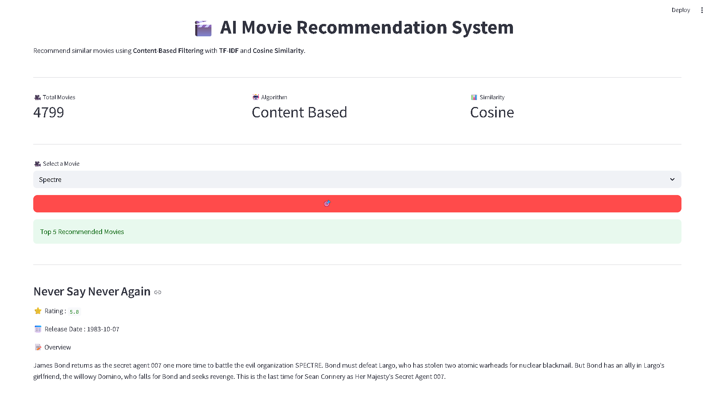

# 🎬 AI Movie Recommendation System

An AI-powered Movie Recommendation System built using **Python, Streamlit, Pandas, Scikit-Learn, TF-IDF, and Cosine Similarity**. This project recommends movies similar to the user's selected movie using a content-based filtering approach.

---

## 📌 Features

- 🎥 Content-Based Movie Recommendation
- 🤖 TF-IDF Vectorization
- 📊 Cosine Similarity Algorithm
- 🎬 User-Friendly Streamlit Web Interface
- ⭐ Movie Ratings
- 📅 Release Date Information
- 📝 Movie Overview
- 🔍 Search & Select Movie
- 📈 Dataset Analytics Dashboard

---

## 🛠️ Tech Stack

- Python
- Streamlit
- Pandas
- NumPy
- Scikit-Learn
- TF-IDF Vectorizer
- Cosine Similarity

---

## 📂 Dataset

- TMDB 5000 Movies Dataset

---

## 📸 Project Preview

> Add your project screenshot here.

Example:



---

## 🚀 Installation

Clone the repository:

```bash
git clone https://github.com/ganeshkumar1887/DecodLabs-AI-Internship.git
```

Go to the project folder:

```bash
cd "Movie recommendations system"
```

Install dependencies:

```bash
pip install -r requirements.txt
```

Run the application:

```bash
streamlit run app.py
```

---

## 📁 Project Structure

```
Movie recommendations system/
│── app.py
│── recommendation.py
│── train_model.py
│── movies.pkl
│── similarity.pkl
│── tmdb_5000_movies.csv
│── requirements.txt
│── README.md
│── project.png
```

---

## 🎯 Future Improvements

- 🎥 Movie Posters using TMDB API
- 🔥 Trending Movies Section
- 🎭 Genre-Based Recommendations
- ⭐ User Ratings & Reviews
- ☁️ Streamlit Cloud Deployment

---

## 👨‍💻 Developer

**Ganesh Kumar**

B.Tech CSE (AI & ML)

Sanskriti University

---

## ⭐ If you like this project

Give this repository a ⭐ on GitHub!
